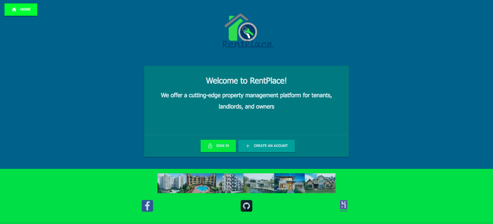
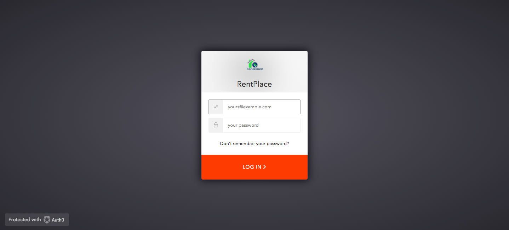
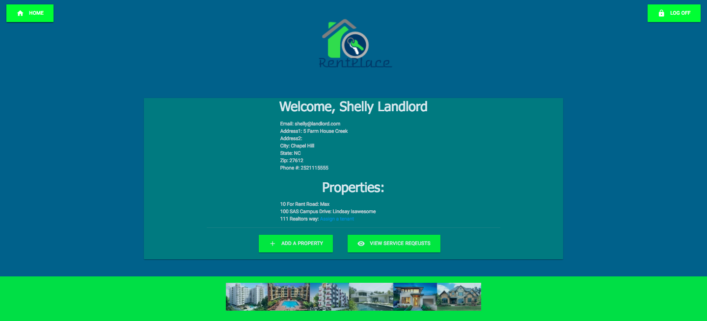
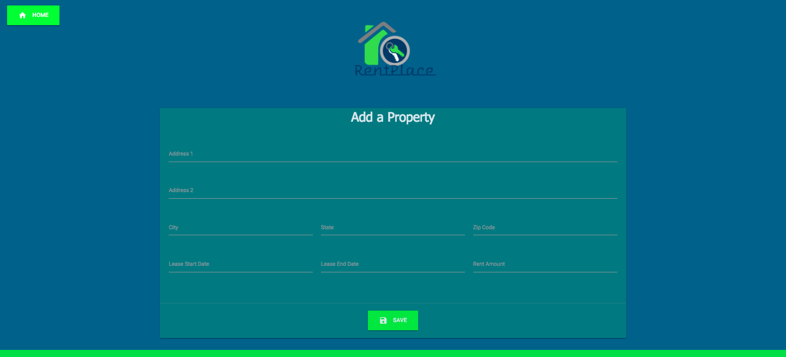
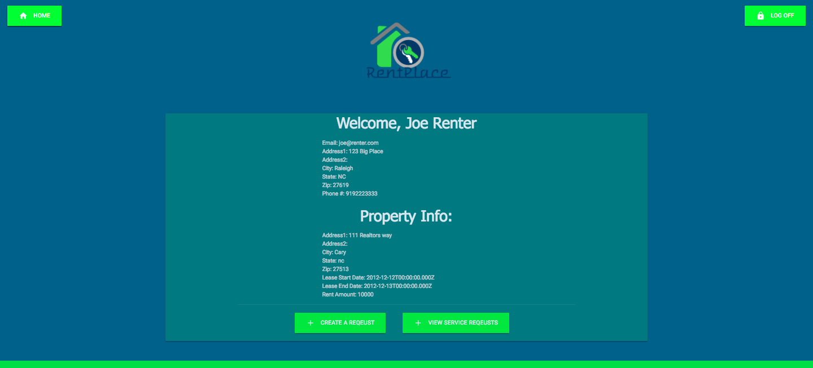
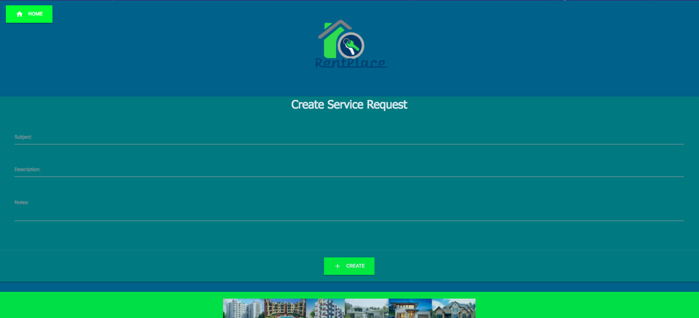
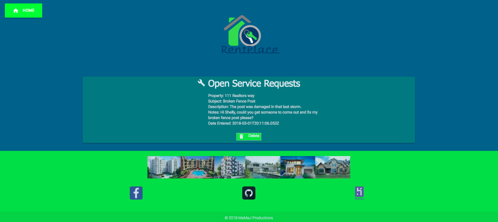

# RentPlace

RentPlace is a lightweight dashboard to connect landlords and tenants, so both parties can get information about the properties, lease info, and submit and reply to service requests.

To run, install packages using yarn install in the root and clients folders, then yarn start.

1. The Home Page

2. The Login Page

3. The Landlord View
    _ Create a property
    _ Assign a tenant to a property
    _ View open service requests

4. Creating a property

5. The Tenant View
    _ View property details
    _ Create service requests
    _ View open service requests

6. Creating a service request

7. View Service Requests

*This app was created by Max Wang, Matt Gnagy, and Jason Peck* 